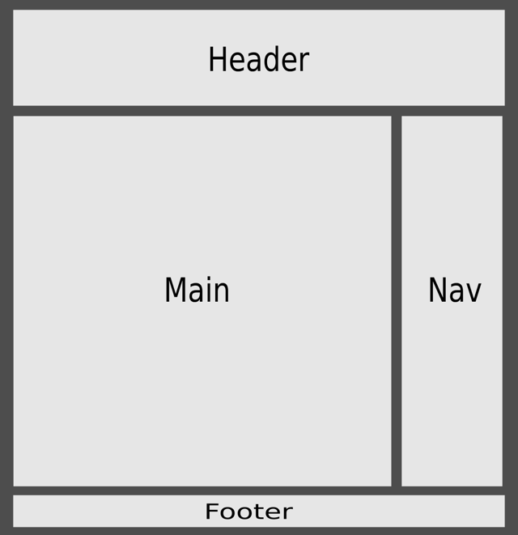

#網頁結構[Deprecated]

@(104-1.網站程式設計)[html]

---

###基本網頁結構

一個最基本的網頁必需包含以下的結構標籤

```html

<html>                              <!-- (1) -->
  <head>                            <!-- (2) -->
    <title>Web Structure</title>    <!-- (3) -->

  </head>
  <body>                            <!-- (4) -->
    ...
  </body>
</html>

```

1. `<html>`: 根標籤,網頁中最上層的(根)的標籤
2. `<head>`: 網頁裡的頭部份宣告,這裡面所存放的標籤一般與網頁實際顯示的內容無關,大多是一些相關的設定、外部資源的引入、樣式的宣告、腳本語語的宣告、網站資訊揭露...等
3. `<title>`: 設定網頁的抬頭資訊,會顯示在瀏覽器的最左上角處
4. `<body>`: 網頁裡的本體部份,這裡是網頁顯示的部份

###一些術語

- `tag`: 標籤
- `element`: 元素
- `attribute`: 屬性
- `style`: 樣式
- `value`: 值
- `content`: 內文

###一個較完整的網頁結構

下圖是一個較完整的網頁,其內容由數個不同的區域組成

1. `Header`: 網頁的標題區,放置該網站的識別圖示(logo)、主題...等相關資訊
2. `Nav`: 導覽區(或側邊欄),網站的目錄或是一些與主題沒有直接相關的訊息
3. `Main`: 主要內容區,網頁主要的本體
4. `Footer`: 註腳區,可以放入像是公司資訊,版權宣告...等資訊



```html
<html>
  <head>
    <title>Old Web Structure</title>
    <!--(1)-->
    <style>
    #header, #nav, #main, #footer {
      color: white;
    }
    #header, #footer {
      text-align: center;
      width: 100%;
    }
    #header {
      height: 64px;
      background-color: red;
      font-size: 36px;
      font-weight: bold;
    }
    #main {

      float: left;
      width: 70%;
      height: 540px;
      background-color: gray;
      padding: 10px;
      margin: 10px;
    }

    #nav {
      float: right;
      right: 25px;
      background-color: blue;
      width: 23%;
      height: 540px;
      padding: 10px;
      margin: 10px;
    }
    #footer {
      clear: both;
      background-color: green;
      font-size: 10px;
      height: 64px;
    }
    </style>
  </head>
  <body>
    <!--(2)-->
    <div id="header">
      header
    </div>
    <div id="nav">
      <ul>
        <li>nav 1</li>
        <li>nav 2</li>
      </ul>  
    </div>
    <div id="main">
      article
    </div>
    <div id="footer">
      <p>
        footer © 2011
      </p>
    </div>
  </body>
</html>
```

1. 這裡是樣示表(css)的設定,用來定義本網頁中相關的元素的表現方式(大小、位置、顏色...等)
2. 這裡是各區域的html標籤,主要是以`<div>`元素為主要分區元素
---

參考: http://pydoing.blogspot.tw/2012/10/html-css-tutorial.html
