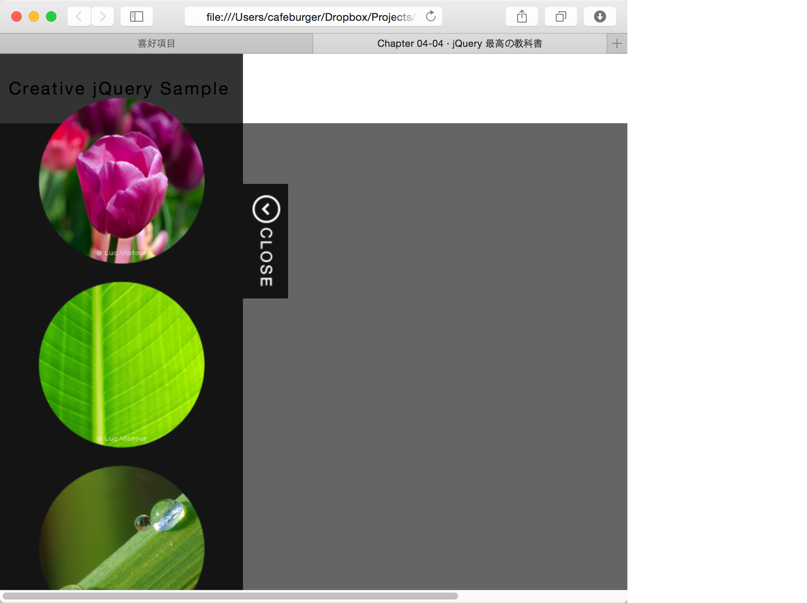

#收合式側邊欄

@(104-1.網站程式設計)[jquery_sample]

---

###效果

正常情形下...

側邊欄打開時...


###HTML程式碼

```html
<!DOCTYPE html>
<html lang="ja">
<head>
<meta charset="UTF-8">
<meta http-equiv="X-UA-Compatible" content="IE=edge">
<title>Chapter 04-04 &#xB7; jQuery 最高の教科書</title>
<link rel="stylesheet" href="./css/normalize.css">
<link rel="stylesheet" href="./css/main.css">

<script src="./js/vendor/jquery-1.10.2.min.js"></script>
<script src="./js/vendor/jquery-ui-1.10.3.custom.min.js"></script>
<script src="./js/main.js"></script>
</head>
<body>
<header class="page-header" role="banner">
    <h1>Creative jQuery Sample</h1>
</header>
<div class="page-main" role="main">
    <!-- (1) -->
    <aside>
        <ul>
            <li><a href="#"></a></li>
            <li><a href="#"></a></li>
            <li><a href="#"></a></li>
        </ul>
        <button></button>
    </aside>
</div>
<footer class="page-footer" role="contentinfo">
    <small class="copyright">COPYRIGHT &copy; <a href="http://www.shiftbrain.co.jp" target="_blank">SHIFTBRAIN Inc.</a></small>
</footer>
</body>
</html>
```

說明： 

1. `<aside>`是html5的新標簽,主要是標識其內容為側邊欄資料.在這裡面,利用`<ul>`及`<li>`加入了三張圖片,以及一個`<button>`元素

###CSS主要部份

```css
.page-main > aside {
    background-color: rgba(0,0,0,0.8);
    width: 350px;   /*(2)*/
    height: 100%;   /*(3)*/
    top: 0;
    left: -350px;   /*(1)*/
    position: fixed;
}

.page-main > aside ul {
    margin: 0;
    padding: 0;
    top: 50px;
    left: 114px;
    position: absolute;
}

.page-main > aside li {
    margin: 0 0 20px;
    list-style: none;
}

.page-main > aside button {
    background-color: rgba(0,0,0,0.8);
    display: block;
    position: absolute;
    top: 150px;
    left: 350px;
    width: 52px;
    height: 132px;
    margin: 0;
    padding: 0;
    border: none;
}
```

1. 這裡是側邊欄的主要設定,透過`left: -350`,使其整個側邊欄均向左平移`350px`,剛好移到左邊之外!
2. 這是寬度的設定,其值需與向左平移量相同
3. 高度的部份必需要與瀏覽的高度相等,故設`100%`

###javascript 部份

```javascript

$(function(){
    // 
    var duration = 300;

    // 取得aside的jquery物件 (1)
    var $aside = $('.page-main > aside');
    // (1)
    var $asidButton = $aside.find('button')
        .on('click', function(){
            $aside.toggleClass('open'); // (2)
            if($aside.hasClass('open')){ // (3)
                $aside.stop(true).animate({left: '-70px'}, duration, 'easeOutBack');
                $asidButton.find('img').attr('src', 'img/btn_close.png');
            }else{
                $aside.stop(true).animate({left: '-350px'}, duration, 'easeInBack');
                $asidButton.find('img').attr('src', 'img/btn_open.png');
            };
        });

});
```

1. 這裡分別有二個變數`$aside`及`$asidButton`,將選擇出來的元素存放在變數中,不僅可以在多次使用時不會使jQuery都去DOM中查尋一次(即效率會變好),主要還是在事件裡還會用到這二個變數

2. `toggleClass()`會使其指定的class名稱(這例子中是`open`)若不存在則加入(`addClass()`)或若存在則移除(`removeClass()`)

3. 在此判斷`open`class的存在與否,來做不同的處理
   - 若有`open`,則將側邊欄的`left`改為`-70px`(會是-70px主要是配合裡面的圓圖大小),同時將按鍵的圖改為"關閉"的圖樣
   - 若無`open`,則將側邊欄移出(`left: -350px`),亦將按鍵圖片改成"開啟"的圖樣
