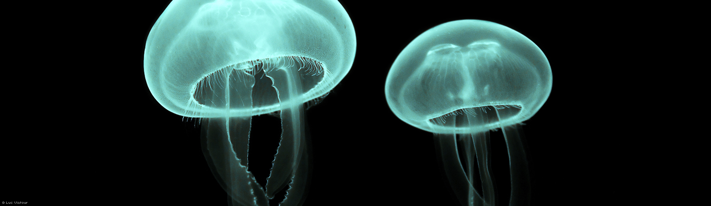

#幻燈片展示(進階)

@(104-1.網站程式設計)[jquery_sample]

---

###效果

- 除了範例3的功能外,當滑鼠移入圖片時,將停止自動切換一張

- 加入上下頁按鍵及分頁器


###HTML程式碼

```html
<!-- 略,同範例3 -->

<div class="slideshow"> <!-- (1) -->
    <div class="slideshow-slides">  <!-- (2) -->
        <a href="./" class="slide" id="slide-1"></a>
        <a href="./" class="slide" id="slide-2"></a>
        <a href="./" class="slide" id="slide-3"></a>
        <a href="./" class="slide" id="slide-4"></a>
    </div>
    <div class="slideshow-nav"> <!-- (3) -->
        <a href="#" class="prev">Prev</a>
        <a href="#" class="next">Next</a>
    </div>
    <div class="slideshow-indicator"></div> <!-- (4) -->
</div>

```

說明： 
1. 幻燈片最外層
2. 這裡內層不只有圖片的部份,這裡多加一層來包覆所有圖片
3. 這裡是左右箭頭的部份
4. 這裡圓點的部份

####slideshow的結構


如上圖所示,所有的slide均橫向直線排列(這與範例3不同),有點像影片的膠捲,最後會透過左右的橫移來做出幻燈片的效果!


###CSS主要部份

幻燈片配置相關的css
```css
.slideshow {
    background-color: rgb(0, 0, 0);
    height: 465px;  /*(1)*/
    min-width: 960px;
    overflow: hidden;  /*(2)*/
    position: relative;
}

.slideshow-slides {
    height: 100%;
    position: absolute; /*(3)*/
    width: 100%;
    
}
.slideshow-slides .slide {
    height: 100%;
    overflow: hidden;
    position: absolute;  /*(4)*/
    width: 100%;
    
}
.slideshow-slides .slide img {
    left: 50%;              /*(5)*/
    margin-left: -800px;    /*(5)*/
    position: absolute;
}
```

1. 最外層容器的高度配合圖片的高度
2. 由於我們會將所有圖片橫向排列,`overflow: hidden`會隱藏橫向的捲軸條(scroll bar)
3. 設定位置的方式為絕對位置,並會以javascript來改變`left`的值使其平移
4. `slides`表示各個元素,因為要橫向排列,所以先用絕對位置,並以javascript來改變其每一個元素的`left`值
5. 這裡的設定原理同範例3

左右箭頭的css
```css
.slideshow-nav a,
.slideshow-indicator a {
    background-color: rgba(0, 0, 0, 0); /* for IE9 */
    overflow: hidden;
}
.slideshow-nav a:before,
.slideshow-indicator a:before {
    content: url(../img/sprites.png);   /*(6)*/
    display: inline-block;
    font-size: 0;
    line-height: 0;
}

.slideshow-nav a {
    position: absolute;
    top: 50%;
    left: 50%;
    width: 72px;
    height: 72px;
    margin-top: -36px;
}
.slideshow-nav a.prev {
    margin-left: -480px;
}
.slideshow-nav a.prev:before {
    margin-top: -20px;    
}
.slideshow-nav a.next {
    margin-left: 408px;
}
.slideshow-nav a.next:before {
    margin-left: -80px;
    margin-top: -20px;
}
.slideshow-nav a.disabled { /*(7)*/
    display: none;
}
```

6. 利用`content`來讀取圖片
7. 當以下二個情形時,會加入`disabled`的class,使其符合這組css而達成隱藏的效果
   - `slide`為第一張時,則不顯示左箭按揵
   - `slide`為最後一張時,則不顯示右箭按揵

分頁器(圓點)的css
```css
.slideshow-indicator {
    bottom: 30px;
    height: 16px;
    left: 0;
    position: absolute;
    right: 0;
    text-align: center;
}
.slideshow-indicator a {
    display: inline-block;
    width: 16px;
    height: 16px;
    margin-left: 3px;
    margin-right: 3px;
}
.slideshow-indicator a.active {     /*(8)*/
    cursor: default;
}
.slideshow-indicator a:before {
    margin-left: -110px;
}
.slideshow-indicator a.active:before {  /*(8)*/
    margin-left: -130px;
}
```

8. 透過以javascript加入`active`class來使其合這裡的樣式

no-js的css設定: (no-js的義意請見範例3)
```css
.no-js .slideshow {
    height: auto;
}
.no-js .slideshow-slides {
    height: auto;
    position: static;
}
.no-js .slideshow-slides .slide {
    display: block;
    height: auto;
    position: static;
}
.no-js .slideshow-slides .slide img {
    margin: auto;
    position: static;
}
.no-js .slideshow-nav,
.no-js .slideshow-indicator {
    display: none;
}
```

###javascript 部份

```javascript
$(function () {

    /*
     * Slideshow
     */
    $('.slideshow').each(function () {      /* (1) */

    // 變數準備
    // - - - - - - - - - - - - - - - - - - - - - - - - - - - - - - -
        /* (2) */
        var $container = $(this),                                 // a
            $slideGroup = $container.find('.slideshow-slides'),   // b
            $slides = $slideGroup.find('.slide'),                 // c
            $nav = $container.find('.slideshow-nav'),             // d
            $indicator = $container.find('.slideshow-indicator'), // e
            // SlideShow內各元素的jQuery物件
            // a SlideShow整體的container
            // b 所有Slide的彙整(SlideGroup)
            // c 各個Slide
            // d 瀏覽鏈結(Prev/Next)
            // e 指標鏈結(Dot)

            slideCount = $slides.length, // Slide的個數
            indicatorHTML = '',          // 指標鏈結的內容
            currentIndex = 0,            // 目前Slide的索引值
            duration = 500,              // 轉換至下個Slide所需的動畫時間
            easing = 'easeInOutExpo',    // 轉換至下個Slide的easing種類
            interval = 7500,             // 自動切換的時間
            timer;                       // 用以儲存timer


    // HTML元素的配置、建立與插入
    // - - - - - - - - - - - - - - - - - - - - - - - - - - - - - - -

        // 決定各個Slide的位置
        // 並建立對應的指標鏈結
        $slides.each(function (i) {
            $(this).css({ left: 100 * i + '%' });
            indicatorHTML += '<a href="#">' + (i + 1) + '</a>';
        });

        // 插入指標鏈結的內容
        $indicator.html(indicatorHTML);


    // 函數定義
    // - - - - - - - - - - - - - - - - - - - - - - - - - - - - - - -

        // 用以顯示任意Slide的函數
        function goToSlide (index) {     /* (3) */
            // SlideGroup配合目標位置移動
            $slideGroup.animate({ left: - 100 * index + '%' }, duration, easing);
            // 記錄當前Slide的索引值
            currentIndex = index;
            // 更新瀏覽鏈結、指標鏈結的狀態
            updateNav();
        }

        // 依照Slide狀態更新瀏覽鏈結、指標鏈結的函數
        function updateNav () {         /* (4) */
            var $navPrev = $nav.find('.prev'), // Prev (前進) 鏈結
                $navNext = $nav.find('.next'); // Next (後退) 鏈結
            // 若為第一個Slide，則將Prev瀏覽鏈結設定無效
            if (currentIndex === 0) {
                $navPrev.addClass('disabled');
            } else {
                $navPrev.removeClass('disabled');
            }
            // 若為最後的Slide，則將Next瀏覽鏈結設定無效
            if (currentIndex === slideCount - 1) {
                $navNext.addClass('disabled');
            } else {
                $navNext.removeClass('disabled');
            }
            // 將當前Slide的指標鏈結設定無效
            $indicator.find('a').removeClass('active')
                .eq(currentIndex).addClass('active');
        }

        // 起始timer的函數
        function startTimer () {        /* (5) */
            //利用變數interval設定經過多久的時間就執行處理 
            timer = setInterval(function () {
                // 以當前Slide的索引值決定下個要顯示的Slide
                // 若為最後的Slide則顯示第一張Slide
                var nextIndex = (currentIndex + 1) % slideCount;
                goToSlide(nextIndex);
            }, interval);
        }

        // 停止tismer的函數
        function stopTimer () {         /* (6) */
            clearInterval(timer);
        }


    // 事件註冊
    // - - - - - - - - - - - - - - - - - - - - - - - - - - - - - - -

        // 點擊瀏覽鏈結後顯示對應的Slide
        $nav.on('click', 'a', function (event) {
            event.preventDefault();
            if ($(this).hasClass('prev')) {
                goToSlide(currentIndex - 1);
            } else {
                goToSlide(currentIndex + 1);
            }
        });

        // 點擊指標鏈結後顯示對應的Slide
        $indicator.on('click', 'a', function (event) {
            event.preventDefault();
            if (!$(this).hasClass('active')) {
                goToSlide($(this).index());
            }
        });

        // 滑鼠移入時暫停timer，移出則啟動timer
        $container.on({
            mouseenter: stopTimer,
            mouseleave: startTimer
        });


    // 啟動SlideShow
    // - - - - - - - - - - - - - - - - - - - - - - - - - - - - - - -

        // 顯示最初的Slide
        goToSlide(currentIndex);

        // 啟動timer
        startTimer();

    });

});
```

1. 這部份與範例3相同
2. 這裡除了定義了變數外,也將各個功能定義在以下各函式中
3. `goToslide(index)`: 跳到指定(index)的`slide`
4. `updateNav()`: 更新左右箭頭(是否該顯示)及分頁器(那一個為作用中)
5. `startTimer()`: 啟動運作
6. `stopTimer()`: 停止運作

---
對於`position`屬性的說明,也可以看看[這篇文章](http://zh-tw.learnlayout.com/position.html)