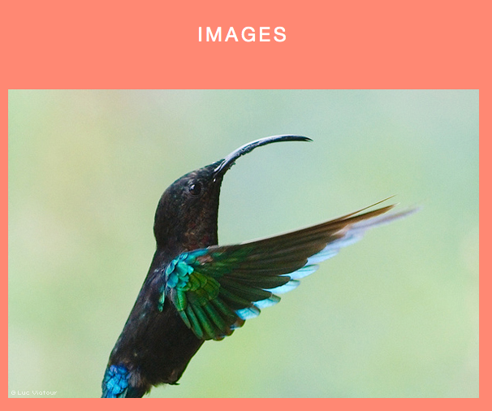
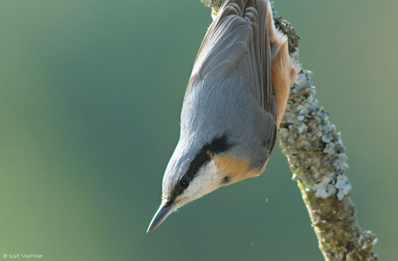

#圖片標題的顯示

@(104-1.網站程式設計)[jquery_sample]

---

###效果

正常情形下...


當滑鼠移入時...


###HTML程式碼

```html
<!DOCTYPE html>
<html lang="ja">
<head>
    <meta charset="UTF-8">
    <meta http-equiv="X-UA-Compatible" content="IE=edge">
    <title>Chapter 04-02 &#xB7; jQuery 最高の教科書</title>
    <link rel="stylesheet" href="./css/normalize.css">
    <link rel="stylesheet" href="./css/main.css">
    <script src="./js/vendor/jquery-1.10.2.min.js"></script>
    <script src="./js/vendor/jquery-ui-1.10.3.custom.min.js"></script>
    <script src="./js/main.js"></script>
</head>
<body>
    <header class="page-header" role="banner">
        <h1>Creative jQuery Sample</h1>
    </header>
    <div class="page-main" role="main">
        <div id="images">
            <h2>IMAGES</h2>
            <div class="inner clearfix">
                <!-- (1) -->
                <p><strong>Hummingbird</strong><span></span></p> 
                <p><strong>Sitta</strong><span></span></p>
                <p><strong>Bee-eater</strong><span></span></p>
            </div>
        </div>
    </div>
    <footer class="page-footer" role="contentinfo">
        <small class="copyright">COPYRIGHT &copy; <a href="http://www.shiftbrain.co.jp" target="_blank">SHIFTBRAIN Inc.</a></small>
    </footer>
</body>
</html>

```

說明： 

1. 此處三張圖片中，安插了一個空白的`<span>`元素,之後會透過jQuery的CSS操作,也就是當滑鼠移入後會在此元素裡加入效果！

###CSS部份


```css
#images p {
    overflow: hidden;
}

#images p strong {
    /* (1) */
    position: absolute; /* (1-1) */
    display: block;     
    z-index: 1;         /* (1-2) */
    bottom: 0;          /* (1-3) */
    /* (2) */
    width: 540px;
    height: 30px;
    background: rgba(0, 0, 0, 0.5);
    
    text-align: left;
    padding: 20px;
}

#images p span {
    position: absolute;
    display: block;
    z-index: 0;
    top: 0;
    width: 580px;
    height: 380px;
    /* (3) */
    box-shadow: inset 0 0 50px rgba(50, 30, 0, 0.6),
                inset 0 0 100px rgba(50, 30, 0, 0.3);
    background: rgba(255, 155, 0, 0.2);
    /* (4) */
    opacity: 0;
}
#images p:nth-child(1) strong {
    /* (5) */
    opacity: 0;
}
```

1. 這裡是一些佈局設定
  1-1. 使用"絕對位置"來設定`<strong>`(及`<span>`)的位置,
  1-2. 並以`z-index`設定前後關係(數值大者在前)
  1-3. `bottom: 0`可以使`<strong>`與上層容器的底邊對齊
2. 初始情形設定標題的背景為"半透明的黑色四邊形"
3. 將`<span>`設定"內側陰影"及"半透明背景"
4. 初始的`<span>`亦設為全透明(不可視)
5. 針對第一張圖，設定透明度為0(完全透明)

###javascript 部份

```javascript

$(function(){
    // 
    var duration = 300;

    // images ----------------------------------------
    var $images = $('#images p');

    // images 第一個圖片
    $images.filter(':nth-child(1)')
        .on('mouseover', function(){
            $(this).find('strong, span').stop(true).animate({opacity: 1}, duration);
        })
        .on('mouseout', function(){
            $(this).find('strong, span').stop(true).animate({opacity: 0}, duration);
        });

    // images 第二個圖片
    $images.filter(':nth-child(2)')
        .on('mouseover', function(){
            $(this).find('strong').stop(true).animate({opacity: 1, left: '0%'}, duration);
            $(this).find('span').stop(true).animate({opacity: 1}, duration);
        })
        .on('mouseout', function(){
            $(this).find('strong').stop(true).animate({opacity: 0, left: '-200%'}, duration);
            $(this).find('span').stop(true).animate({opacity: 0}, duration);
        });

    // images 第三個圖片
    $images.filter(':nth-child(3)')
        .on('mouseover', function(){
            $(this).find('strong').stop(true).animate({bottom: '0px'}, duration);
            $(this).find('span').stop(true).animate({opacity: 1}, duration);
            $(this).find('img').stop(true).animate({top: '-20px'}, duration * 1.3);
        })
        .on('mouseout', function(){
            $(this).find('strong').stop(true).animate({bottom: '-80px'}, duration);
            $(this).find('span').stop(true).animate({opacity: 0}, duration);
            $(this).find('img').stop(true).animate({top: '0px'}, duration);
        });

});

```

1. 第一張圖片,透過`mouseover`及`mouseout`的事件,將`<strong>`及`<span>`的透明度,以動畫的方式改變其值.(由0漸變到1,或反之)

**在`animate()`之前的`stop(true)`會將之前尚未完成的動畫立即結束

2. 第二張及第三張圖的原理相同,只不過是改變不同的屬性值來達成不同的效果!

###`find()`及`filter()`的差異

- `find()`: 找尋所有子元素中符合條件者,以下範例的二種寫法是等效的!

	```javascript
	$('div').find('.text');
	$('div .text'); // 中間有空白
	```

- `filter()`: 找尋所有本身及子元素中符合條件者

	```javascript
	$('div').filter('.text');
	$('div.text'); // 中間沒有空白
	```

可以透過[執行](https://jsfiddle.net/cafeburger/vynL9z54/2/)以下範例了解其差異

```html
<html>
<head>
<script type="text/javascript" src="jquery-1.3.2.min.js"></script>
<style type="text/css">
    div{
        padding:8px;
        border:1px solid;
    }
</style>
</head>
<body>
<h1>jQuery find() vs filter() example</h1> 
<script type="text/javascript">
  $(document).ready(function(){
    $("#filterClick").click(function () {
        $('div').css('background','white');
        $('div').filter('#Fruits').css('background','red');
    });
 
    $("#findClick").click(function () {
        $('div').css('background','white');
        $('div').find('#Fruits').css('background','red');
    });
 
  });
</script>
</head>
<body>
<div id="Fruits">
    Fruits
    <div id="Apple">Apple</div>
    <div id="Banana">Banana</div>
</div>
<div id="Category">
    Category
    <div id="Fruits">Fruits</div>
    <div id="Animals">Animals</div>
</div>
<br/>
<br/>
<br/>
<input type='button' value='filter(Fruits)' id='filterClick'>
<input type='button' value='find(Fruits)' id='findClick'>
</body>
</html>

```